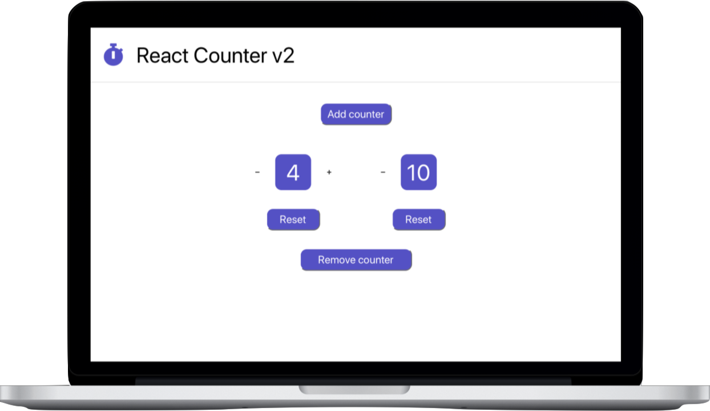

# Counter v2

- Three independent counters,
- Three minus buttons,
- Three plus buttons,
- Three Reset buttons,
- One button to add,
- One button to remove.

### _Languages_ & _Packages_

### _Deployment_

[Netlify](https://react-counterv2.netlify.app)

  
